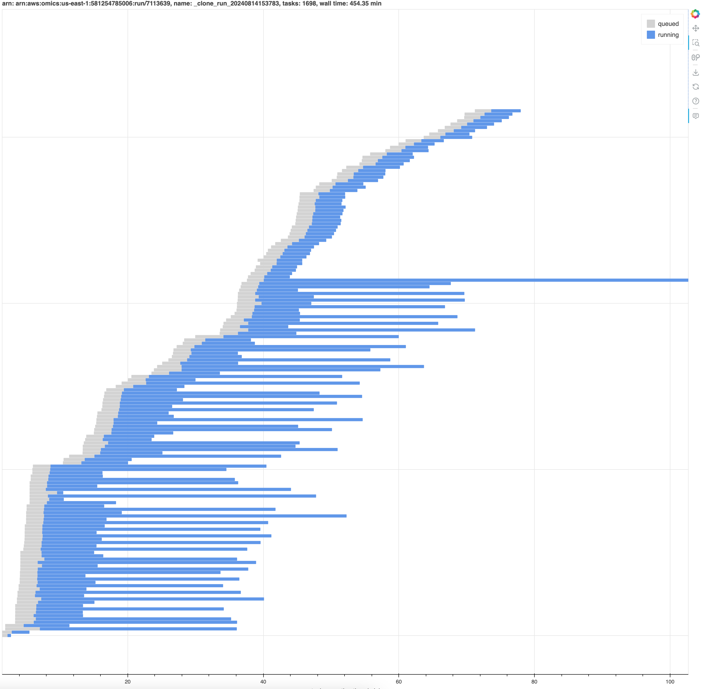

# AWS HealthOmics Tools

SDK and CLI Tools for working with the AWS HealthOmics Service.

- [AWS HealthOmics Tools](#aws-healthomics-tools)
  - [Installation](#installation)
  - [SDK Tools](#sdk-tools)
    - [Omics Transfer Manager](#omics-transfer-manager)
      - [Basic Usage](#basic-usage)
      - [Download specific files](#download-specific-files)
      - [Upload specific files](#upload-specific-files)
      - [Subscribe to events](#subscribe-to-events)
      - [Threads](#threads)
    - [Omics URI Parser](#omics-uri-parser)
      - [Readset file URI:](#readset-file-uri)
      - [Reference file URI:](#reference-file-uri)
  - [CLI Tools](#cli-tools)
    - [Omics Rerun](#omics-rerun)
      - [List runs from manifest](#list-runs-from-manifest)
      - [Rerun a previously-executed run](#rerun-a-previously-executed-run)
    - [Omics Run Analyzer](#omics-run-analyzer)
      - [List completed runs](#list-completed-runs)
      - [Analyze a specific workflow run](#analyze-a-specific-workflow-run)
      - [Output workflow run manifest in JSON format](#output-workflow-run-manifest-in-json-format)
  - [Security](#security)
  - [License](#license)

## Installation
AWS HealthOmics Tools is available through pypi. To install, type:

```bash
pip install amazon-omics-tools
```

### Install from source

Installing from source requires that your machine has the following prerequisites installed: 
- `python3.10` or above
- `poetry` package manager
- `make` build tool

```
git clone https://github.com/awslabs/amazon-omics-tools.git
cd ./amazon-omics-tools
make install
```

## SDK Tools

### Omics Transfer Manager

#### Basic Usage
The `TransferManager` class makes it easy to download files from a AWS HealthOmics reference or read set.  By default the files are saved to the current directory, or you can specify a custom location with the `directory` parameter.

```python
import boto3
from omics.common.omics_file_types import ReadSetFileName, ReferenceFileName, ReadSetFileType
from omics.transfer.manager import TransferManager
from omics.transfer.config import TransferConfig

REFERENCE_STORE_ID = "<my-reference-store-id>"
SEQUENCE_STORE_ID = "<my-sequence-store-id>"

client = boto3.client("omics")
manager = TransferManager(client)

# Download all files for a reference.
manager.download_reference(REFERENCE_STORE_ID, "<my-reference-id>")

# Download all files for a read set to a custom directory.
manager.download_read_set(SEQUENCE_STORE_ID, "<my-read-set-id>", "my-sequence-data")
```

#### Download specific files
Specific files can be downloaded via the `download_reference_file` and `download_read_set_file` methods.
The `client_fileobj` parameter can be either the name of a local file to create for storing the data, or a `TextIO` or `BinaryIO` object that supports write methods.

```python
# Download a specific reference file.
manager.download_reference_file(
    REFERENCE_STORE_ID,
    "<my-reference-id>",
    ReferenceFileName.INDEX
)

# Download a specific read set file with a custom filename.
manager.download_read_set_file(
    SEQUENCE_STORE_ID,
    "<my-read-set-id>",
    ReadSetFileName.INDEX,
    "my-sequence-data/read-set-index"
)
```

#### Upload specific files
Specific files can be uploaded via the `upload_read_set` method.
The `fileobjs` parameter can be either the name of a local file, or a `TextIO` or `BinaryIO` object that supports read methods.
For paired end reads, you can define `fileobjs` as a list of files.

```python
# Upload a specific read set file.
read_set_id = manager.upload_read_set(
    "my-sequence-data/read-set-file.bam",
    SEQUENCE_STORE_ID,
    "BAM",
    "name",
    "subject-id",
    "sample-id",
    "<my-reference-arn>",
)

# Upload paired end read set files.
read_set_id = manager.upload_read_set(
    ["my-sequence-data/read-set-file_1.fastq.gz", "my-sequence-data/read-set-file_2.fastq.gz"],
    SEQUENCE_STORE_ID,
    "FASTQ",
    "name",
    "subject-id",
    "sample-id",
    "<my-reference-arn>",
)
```

#### Subscribe to events
Transfer events: `on_queued`, `on_progress`, and `on_done` can be observed by defining a subclass of `OmicsTransferSubscriber` and passing in an object which can receive events.

```python
class ProgressReporter(OmicsTransferSubscriber):
    def on_queued(self, **kwargs):
        future: OmicsTransferFuture = kwargs["future"]
        print(f"Download queued: {future.meta.call_args.fileobj}")

    def on_done(self, **kwargs):
        print("Download complete")

manager.download_read_set(SEQUENCE_STORE_ID, "<my-read-set-id>", subscribers=[ProgressReporter()])
```

#### Threads
Transfer operations use threads to implement concurrency. Thread use can be disabled by setting the `use_threads` attribute to False.

If thread use is disabled, transfer concurrency does not occur. Accordingly, the value of the `max_request_concurrency` attribute is ignored.

```python
# Disable thread use/transfer concurrency
config = TransferConfig(use_threads=False)
manager = TransferManager(client, config)
manager.download_read_set(SEQUENCE_STORE_ID, "<my-read-set-id>")
```

### Omics URI Parser

The `OmicsUriParser` class makes it easy to parse AWS HealthOmics readset and reference URIs to extract fields relevant for calling 
AWS HealthOmics APIs.


#### Readset file URI: 
Readset file URIs come in the following format: 

```text
omics://<AWS_ACCOUNT_ID>.storage.<AWS_REGION>.amazonaws.com/<SEQUENCE_STORE_ID>/readSet/<READSET_ID>/<SOURCE1/SOURCE2>
```

For example:
```text
omics://123412341234.storage.us-east-1.amazonaws.com/5432154321/readSet/5346184667/source1
omics://123412341234.storage.us-east-1.amazonaws.com/5432154321/readSet/5346184667/source2
```

#### Reference file URI:
Reference file URIs come in the following format: 
```text
omics://<AWS_ACCOUNT_ID>.storage.<AWS_REGION>.amazonaws.com/<REFERENCE_STORE_ID>/reference/<REFERENCE_ID>/source
```
For example:
```text
omics://123412341234.storage.us-east-1.amazonaws.com/5432154321/reference/5346184667/source
```

To handle both HealthOmics URI types, you would use code like the following:

```python
import boto3
from omics.uriparse.uri_parse import OmicsUriParser, OmicsUri

READSET_URI_STRING = "omics://123412341234.storage.us-east-1.amazonaws.com/5432154321/readSet/5346184667/source1"
REFERENCE_URI_STRING = "omics://123412341234.storage.us-east-1.amazonaws.com/5432154321/reference/5346184667/source"

client = boto3.client("omics")

readset = OmicsUriParser(READSET_URI_STRING).parse()
reference = OmicsUriParser(REFERENCE_URI_STRING).parse()

# use the parsed fields from the URIs to call AWS HealthOmics APIs:

manager = TransferManager(client)

# Download all files for a reference.
manager.download_reference(reference.store_id, reference.resource_id)

# Download all files for a read set to a custom directory.
manager.download_read_set(readset.store_id, readset.resource_id, readset.file_name)

# Download a specific read set file with a custom filename.
manager.download_read_set_file(
    readset.store_id,
    readset.resource_id,
    readset.file_name,
    "my-sequence-data/read-set-index"
)
```

## CLI Tools
CLI tools are modules in this package that can be invoked from the command line with:

```bash
python -m omics.cli.<TOOL-NAME>
```

### Omics Rerun

The `omics-rerun` tool makes it easy to start a new run execution from a CloudWatch Logs manifest.

For an overview of what it does and available options run:

```bash
python -m omics.cli.rerun -h
```

#### List runs from manifest
The following example lists all workflow run ids which were completed on July 1st (UTC time):
```bash
python -m omics.cli.rerun -s 2023-07-01T00:00:00 -e 2023-07-02T00:00:00
```

this returns something like:

```text
1234567 (2023-07-01T12:00:00.000)
2345678 (2023-07-01T13:00:00.000)
```

#### Rerun a previously-executed run
To rerun a previously-executed run, specify the run id you would like to rerun:

```bash
python -m omics.cli.rerun 1234567
```

this returns something like:

```text
StartRun request:
{
  "workflowId": "4974161",
  "workflowType": "READY2RUN",
  "roleArn": "arn:aws:iam::123412341234:role/MyRole",
  "parameters": {
    "inputFASTQ_2": "s3://omics-us-west-2/sample-inputs/4974161/HG002-NA24385-pFDA_S2_L002_R2_001-5x.fastq.gz",
    "inputFASTQ_1": "s3://omics-us-west-2/sample-inputs/4974161/HG002-NA24385-pFDA_S2_L002_R1_001-5x.fastq.gz"
  },
  "outputUri": "s3://my-bucket/my-path"
}
StartRun response:
{
  "arn": "arn:aws:omics:us-west-2:123412341234:run/3456789",
  "id": "3456789",
  "status": "PENDING",
  "tags": {}
}
```

It is possible to override a request parameter from the original run. The following example tags the new run, which is particularly useful as tags are not propagated from the original run.

```bash
python -m omics.cli.rerun 1234567 --tag=myKey=myValue

```

this returns something like:
```text
StartRun request:
{
  "workflowId": "4974161",
  "workflowType": "READY2RUN",
  "roleArn": "arn:aws:iam::123412341234:role/MyRole",
  "parameters": {
    "inputFASTQ_2": "s3://omics-us-west-2/sample-inputs/4974161/HG002-NA24385-pFDA_S2_L002_R2_001-5x.fastq.gz",
    "inputFASTQ_1": "s3://omics-us-west-2/sample-inputs/4974161/HG002-NA24385-pFDA_S2_L002_R1_001-5x.fastq.gz"
  },
  "outputUri": "s3://my-bucket/my-path",
  "tags": {
    "myKey": "myValue"
  }
}
StartRun response:
{
  "arn": "arn:aws:omics:us-west-2:123412341234:run/4567890",
  "id": "4567890",
  "status": "PENDING",
  "tags": {
    "myKey": "myValue"
  }
}
```

Before submitting a rerun request, it is possible to dry-run to view the new StartRun request:
```bash
python -m omics.cli.rerun -d 1234567
```

this returns something like:
```text
StartRun request:
{
  "workflowId": "4974161",
  "workflowType": "READY2RUN",
  "roleArn": "arn:aws:iam::123412341234:role/MyRole",
  "parameters": {
    "inputFASTQ_2": "s3://omics-us-west-2/sample-inputs/4974161/HG002-NA24385-pFDA_S2_L002_R2_001-5x.fastq.gz",
    "inputFASTQ_1": "s3://omics-us-west-2/sample-inputs/4974161/HG002-NA24385-pFDA_S2_L002_R1_001-5x.fastq.gz"
  },
  "outputUri": "s3://my-bucket/my-path"
}
```

### Omics Run Analyzer
The `omics-run-analyzer` tool retrieves a workflow run manifest from CloudWatchLogs and generates statistics for the run, including CPU and memory utilization for each workflow task.

For an overview of what it does and available options run:

```bash
python -m omics.cli.run_analyzer -h
```

#### List completed runs
The following example lists all workflow runs completed in the past 5 days:
```bash
python -m omics.cli.run_analyzer -t5d
```

this returns something like:

```text
Workflow run IDs (<completionTime> <UUID>):
1234567 (2024-02-01T12:00:00 12345678-1234-5678-9abc-123456789012)
2345678 (2024-02-03T13:00:00 12345678-1234-5678-9abc-123456789012)
```

#### Analyze a specific workflow run
```bash
python -m omics.cli.run_analyzer 1234567 -o run-1234567.csv
```

this returns something like:

```text
omics-run-analyzer: wrote run-1234567.csv
```

The CSV output by the command above includes the following columns:

* __arn__ : Unique workflow run or task identifier
* __type__ : Resource type (_run_ or _task_)
* __name__ : Workflow run or task name
* __startTime__ : Start timestamp for the workflow run or task (UTC time)
* __stopTime__ : Stop timestamp for the workflow run or task (UTC time)
* __runningSeconds__ : Approximate workflow run or task runtime (in seconds)
* __cpusRequested__ : The number of vCPU requested by the workflow task
* __gpusRequested__ : The number of GPUs requested by the workflow task
* __memoryRequestedGiB__ : Gibibytes of memory requested by the workflow task
* __omicsInstanceTypeReserved__ : Requested HealthOmics instance type for each task
* __omicsInstanceTypeMinimum__ : Minimum HealthOmics instance type that could run each task.
* __recommendedCpus__: The number of CPUs recommended for this task (corresponding to the number of CPUs in the omicsInstanceTypeMinimum)
* __recommendedMemoryGiB__: The amount of GiB of memory recommended for this task (corresponding to the number of CPUs in the omicsInstanceTypeMinimum)
* __estimatedUSD__ : Estimated HealthOmics charges (USD) for the workflow based on _sizeReserved_ and _runningSeconds_
* __minimumUSD__ : Estimated HealthOmics charges (USD) for the workflow based on the recommended _omicsInstanceTypeMinimum_ and _runningSeconds_
* __cpuUtilizationRatio__ : CPU utilization (_cpusMaximum_ / _cpusReserved_) for workflow task(s)
* __memoryUtilizationRatio__ : Memory utilization (_memoryMaximumGiB_ / _memoryReservedGiB_) for the workflow task(s)
* __storageUtilizationRatio__ : Storage utilization (_storageMaximumGiB_ / _storageReservedGiB_) for the workflow run
* __cpusReserved__ : vCPUs reserved for workflow task(s)
* __cpusMaximum__ : Maximum vCPUs used during a single 1-minute interval
* __cpusAverage__ : Average vCPUs used by workflow task(s)
* __gpusReserved__ : GPUs reserved for workflow task(s)
* __memoryReservedGiB__ : Gibibytes of memory reserved for workflow task(s)
* __memoryMaximumGiB__ : Maximum gibibytes of memory used during a single 1-minute interval
* __memoryAverageGiB__ : Average gibibytes of memory used by workflow task(s)
* __storageReservedGiB__ : Gibibytes of storage reserved for the workflow run
* __storageMaximumGiB__ : Maximum gibibytes of storage used during a single 1-minute interval
* __storageAverageGiB__ : Average gibibytes of storage used by the workflow run

For rows that are a _task_ type, the maximums, averages and reserved columns refer to the maximum, average or reserved amounts of the respective resource used by that task. These values can be used to guide the resources that should be requested for that task. For rows that are a _run_ type the maximums, averages and reserved columns refer to the maximum, average or reserved amounts of the respective resource used __concurrently__ by that run. These values can be used to determine if the accounts HealthOmics active CPUs/memory limits are being reached which might indicate the run is constrained by these limits.

> [!WARNING]  
> At this time AWS HealthOmics does not report the average or maximum storage used by runs that use "DYNAMIC" storage that run for under two hours. Because of this limitation the `storageMaximumGiB` and `storageAverageGiB` are set to zero and will not be included in the estimate run cost.

#### Run Optimization and Estimated Cost Reduction

Based on the metrics observed and calculated for a run, the application will recommend the smallest instance type that could be used for each task in the run. The type is reported in the `omicsInstanceTypeMinimum` column. To obtain this type for a task you can set the task CPU and memory requested for the task to the values of `recommendedCpus` and  `recommendedMemoryGiB` in you workflow definition. Based on this change each task would be estimated to
reduce the cost of the run by `estimatedUSD` minus `minimumUSD`. The total potential cost reduction for the entire run can be estimated by subtracting the `minimumUSD` value from the `estimatedUSD` value in the row where the `type` is "`run`".

> [!WARNING]
> Cost estimates are based on the AWS list price at the time the run analysis is performed. In the event prices have changed these may not reflect the price you were charged at the time of the run. Further, the run analyzer does not account for any discounts, credits or price agreements you may have. Price estimates for recommended instance sizes (`minimumUSD`) assume that the runtime of the task will remain the same on the recommended instance. Actual costs will be determined based on the actual runtime.

#### Add headroom to recommendations

Sometimes you will see variance in the amount of memory and CPU used in a run task, especially if you expect to run workflows with larger input files than were used in the analyzed run. For this reason you might want to allow add some headroom to the recommendations produced by the the run analyzer.

The `-H` or `--headroom` flag can be use to add an additional `0.0` to `1.0` times the max CPU or memory used by a task to the calculation used to determine
the `omicsInstanceTypeMinimum` recommendation. For example if a task used a max of 3.6 GiB of memory and the headroom value is 0.5 then 6 GiB of memory - `math.ceil(3.6 * (1 + 0.5))` - will be used to determine the minimum instance type that should be used.

If your analyzed run is already close to optimal then adding headroom might result in the recommended minimum instance being larger than the instance used in the run which will also cause the "`minimumUSD`" to be larger than the "`estimatedUSD`".

#### Produce a timeline plot for a run

The RunAnalyzer tool can produce an interative timeline plot of a workflow. The plots allow you to visualize how individual tasks ran over the course of the run.

```bash
python -m omics.cli.run_analyzer -P plots/ 7113639
```



#### Output workflow run manifest in JSON format

```bash
python -m omics.cli.run_analyzer 1234567 -s -o run-1234567.json
```

this returns something like:
```text
omics-run-analyzer: wrote run-1234567.json
```

#### Output optimized configuration
> [!WARNING]
> Currently this feature only supports Nextflow workflows.

The `--write-config` option will write a new configuration file with the `recommendedCpus` and `recommendedMemoryGiB` as the resource requirements. This will take the maximum values if the task is run multiple times with different inputs. 

```bash
python -m omics.cli.run_analyzer 123456 --write-config=optimized.config
```

#### Aggregate scattered tasks and multiple runs (batch mode)

> [!NOTE]
> This feature is currently experimental and the output may change in future versions. We encourage feedback on which aggregations are useful and which are not. 

The `--batch` option can be used with a single run to aggregate all scattered tasks into one summarized task report. Non scattered tasks are also aggregated but will have a count of 1.

```bash
python -m omics.cli.run_analyzer 1234567 --batch
```

The option may also be used with multiple runs to aggregate all tasks including scattered tasks.

```bash
python -m omics.cli.run_analyzer 1234567 2345678 3456789 --batch
```

These statics are reported in CSV format:

- __"type"__: The type of row (currently always task),
- __"name"__: The base name of the task with any scatter suffix removed
- __"count"__: The number of times the named task has been observed in the runs
- __"meanRunningSeconds"__: The average runtime in seconds for the named tasks
- __"maximumRunningSeconds"__: The longest runtime in seconds for the named task
- __"stdDevRunningSeconds"__: The standard deviation of runtimes for the named task
- __"maximumCpuUtilizationRatio"__: The highest CPU utilization ratio seen for any of the named tasks
- __"meanCpuUtilizationRation"__: The average CPU utilization ratio for the named task
- __"maximumMemoryUtilizationRatio"__: The highest memory utilization ratio seen for any of the named tasks
- __"meanMemoryUtilizationRation"__: The average memory utilization ratio for the named task
- __"maximumGpusReserved"__: The largest number of GPUs reserved for the named tasks
- __"meanGpusReserved"__: The average number of GPUs reserved for the named task
- __"recommendedCpus"__: The recommended number of Cpus that would accommodate all observed instances of a task (including any headroom factor)
- __"recommendedMemoryGiB"__: The recommended GiBs of memory that would accommodate all observed instances of a task (including and headroom factor)
- __"recommendOmicsInstanceType"__: The recommended omics instance type that would accomodate all observed instances of a task
- __"maximumEstimatedUSD"__: The largest estimated cost observed for the named task.
- __"meanEstimatedUSD"__: The average estimated cost observed for the named task.

## Security

See [CONTRIBUTING](https://github.com/awslabs/amazon-omics-tools/blob/main/CONTRIBUTING.md#security-issue-notifications) for more information.

## License

This project is licensed under the Apache-2.0 License.

